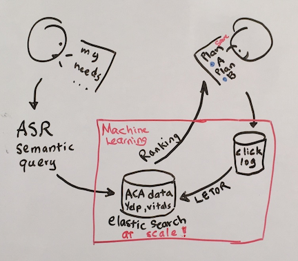
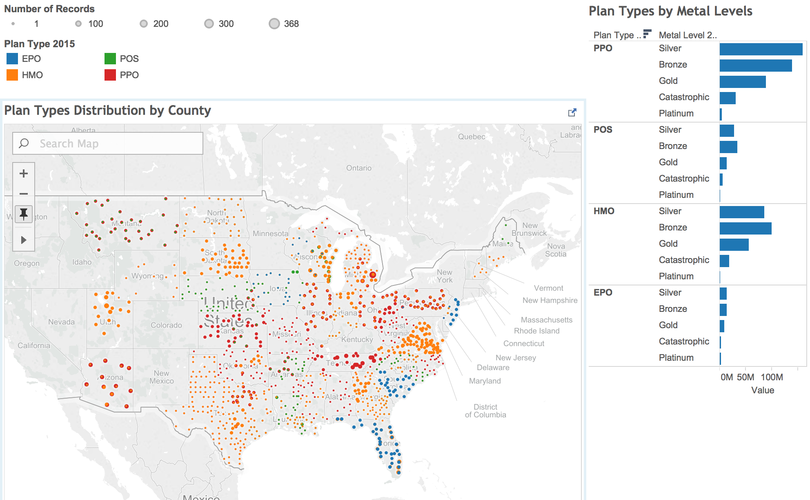

# HHS Challenge (Bayes Hack 2016) - Semantic Search Engine

- Team: Innocent Bayestanders
- Members: Ron Cordell, Konniam Chan, Chris Dailey, Marjorie Sayer, Safyre Anderson
- Mentors: Jimi Shanahan, David Portnoy
- Date: April 28, 2016

### Abstract
We aimed to connect people with the health care plan that best serves their needs. Current recommenders such as `healthcare.gov` and StrideHealth are a skin on top of the complicated mess that is health plan data. Users are shown options that match their basic demographic and financial status. Their medical history is boiled down to a list of terms. Close to nothing is done to communicate the details of the plan in understandable layman's terms or why a plan is selected for that user. To go a step further, we’re building a faceted search engine that learns. Think Google + Amazon; PageRank + Facets. Powered by combined healthcare data, third party reviews from sources like Yelp and other sources, users are able to search more simply yet more completely than ever before.  As the search engine grows in popularity, so will the matching ability of the results. Each pause and click on the website is captured and fed to a Learn to Rank (LETOR) algorithm.  We are taking health care to a new level that brings the users closer to finding the healthcare they need.

### Problem
 The ACA insurance marketplace has been problematic for consumers since its inception. It is difficult to choose a suitable ACA plan or compare features among plans. Providers are not always in network. Recommendations are simply a filter on insurance company data, and not matched to patients' needs. We propose adapting the lessons from consumer web giants, Google and Amazon, to the insurance marketplace.

### End-to-End Solution

#### Overview:

The system consists of a web application with two stages. In the first stage, we ask the user a series of questions about their demographics, their preferences for certain particular providers, and a subset of their existing medical conditions. Additionally, we provide a free-form text box for users to enter key words--for example, "acupuncture", "alternative medicine", "oncology"--which will be matched to descriptions tied to each plan. Each ACA plan contains information about their providers, network coverage, and drugs. We will add features such as physician rankings from third-party resources such as Yelp and Vitals.com. The highest-ranked plans are returned to the user in a faceted results page. Users have access to a series of filters that narrow down various plans, and they can select one that best fits their needs.

In the second stage, the user's interactions on the results page are all collected via a clickstream collector. Over time, user click behavior statistics such as dwell times, mean reciprocal rank (MRR), and detail expansions are collected, stored, and processed into training data for our learn-to-rank (LETOR) algorithm. The LETOR algorithm is the key differentiator between our framework and existing frameworks: the system gets smarter as more users interact with it.

#### Backend:

##### Data
[The core data is publicly available as of late 2015 and consists of machine readable JSON files.](data/README.md)

ACA plan types appear to be relatively homogenous within states.

##### ElasticSearch
The ElasticSearch cluster was created using bare metal servers from IBM's Softlayer Infrastructure-as-a-Service. The cluster consisted of 6 CentOS 7 servers with 8 GB RAM and 100 GB SSDs each connected via passwordless SSH. One server acted as the ElasticSearch master node, while the remaining 5 held the data. The ElasticSearch engine is easily adaptable to new servers by simply added new servers and server hostnames to the configurations. Though in our implementation, there data were only stored as one copy, ElasticSearch is capable of storing multiple copies of the data for disaster recovery.

##### ClickStream Data and Machine Learning
Clickstream data is captured with [snowplow](https://github.com/snowplow/snowplow). User-interaction events, such as actions to expand plan descriptions and clicks to provider websites are captured in this platform, and forwarded to a S3 bucket for storage. Users' response to the survey questions and the plan details can be captured in the same S3 bucket as well.

With the present data, plan ranking is done by rules and simple query intersection. Data types are categorial or ranges (such as smoker Yes/No, income range). To reach our goal of semantic search, our system must learn to incorporate semantic features. This is a [Learning To Rank](http://research.microsoft.com/en-us/people/taoqin/letor3.pdf) (LETOR) problem. A major initial challenge of a LETOR problem is obtaining training data, both features and labels. For supervised learning, we need rankings of plans, given semantic search features. 

These rankings are derived from clickstream data. Once enough data has come through the system, we can use machine learning to rank suitability of plans. 

For example: suppose the existing model using traditional data works as follows:

Input feature: 

| Age | Gender | Existing Medical Condition | Plan Premium | Co-Pay | HMO/PPO | 
|-----|--------|----------------------------|--------------|--------|---------|
| 50  | F      | Type II Diabetes           | 100          | 20     | HMO     | 

The existing system would generate the following ranking: 

|Plan A | Plan B| Plan C|
|-------|-------|-------|
| 0.76  |0.54   | 0.37  |

However, using additional query terms from our free-from entry, we would present: 

|Plan A | Plan B| Plan C| Plan D    | Plan E              |
|-------|-------|-------|-----------|---------------------|
| 0.76  |0.54   | 0.37  |Acupuncture|Pain Management Class|

This would in turn generate dwell time and click data for Plans A, B, C, D, and E with the following sample features: 

| Age | Gender | Existing Medical Condition | Plan Premium | Co-Pay | HMO/PPO | Acupuncture | Pain Management Class |
|-----|--------|----------------------------|--------------|--------|---------|-------------|-----------------------|
| 50  | F      | Type II Diabetes           | 100          | 20     | HMO     | yes         | yes                   |

A sample table (with logs processed and joined), might look like the following:  
  
| Age | Gender | Existing Medical Condition | Plan Premium | Co-Pay | HMO/PPO | Acupuncture| Pain Management| Click Plan E |
|-----|--------|----------------------------|--------------|--------|---------|------------|----------------|--------------|
| 50  | F      | Type II Diabetes           | 100          | 20     | HMO     | yes        | yes            | 1            |
| 50  | F      | Type II Diabetes           | 150          | 20     | HMO     | no         | yes            | 0            |
| 50  | F      | Type II Diabetes           | 200          | 0      | PPO     | maybe      | yes            | 1            |

A variety of classifiers can be used to predict the probability of a click to a given plan. Logistic regression would be a great starting point for a baseline model. More sophisticated algorithms such as random forests could be used as well. As clickstream data accumulates beyond a few GB's, we can use Spark to handle the computations. The ML model can be recomputed daily, and fed back into the ElasticSearch cluster to aid the ranking efforts in the web app.

#### Frontend
*Web Framework and UI*  
[Flask](http://flask.pocoo.org), a python web framework based on Werkzeug and Jinja 2, was used in this application. Flask is a lightweight framework, with a plethora of extensions that allow for application features such as form validation, object-relational mappers, and programmatic rendering of HTML. The UI is a barebones setup currently with some [Bootstrap](http://getbootstrap.com) elements. It is straightforward to expand on the design and make it more user-friendly.

### Privacy
In order to provide a personalized set of plans for our users, inevitably we need to collect demographics and location data. While any one field does not identify the record (unless it is a *direct identifier*&mdash;name, address, ssn, etc), the combination of the *quasi-identifiers* (e.g. zipcodes, gender) could very well do. Because it is a lot more work to handle personally identifiable information (PII), our best course of action would be to ensure that any record we save is deidentified. We can accomplish this by not collecting any direct identifier, and applying the below techniques to quasi-identifiers:

- *Generalization*. The feature is made less precise. For example, collect the user's age (say 50), but bin it during collection (say 45-60 bucket).  
- *Suppression*. Certain values of data are removed. This could mean the entire record, or part of a record.  

A privacy policy should be in place, to explain what data the system is collecting, what the data are used for, and how long they are kept in the database.

### Open Source
The plan is to open-source the architecture of this end-to-end healthcare recommendation engine so that others can built on it. While there could be issues regarding certain bad actors trying to manipulate the system, we think the semantic search engine is a worthwhile improvement over the existing system.

### Future Work
*Feature Enrichment*  
Current online provider rankings might not be as targeted or useful as we'd like, and might not differentiate plans. With time, our feature set can improve. As people enter free-form information, a rich set of user-generated features emerges that is naturally bundled with demographic information.   
  
*ASR*    
ASR (automatic speech recognition) can be used to aid input from the user. The target demographic for ACA often only has one computing device (smartphone). ASR allows queries to be more easily personalized and enables the best user experience. ASR unlocks a further potential to enrich the model feature set by capturing both key terms and nuance of expression - user sentiment.   
  
An interesting side experiment would be whether the presence of a voice chatbox encourages users to bring more information to the query process itself, and/or be more invested in the results, simply by engaging via voice rather than a form. 

